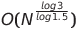
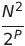
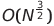
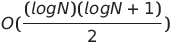
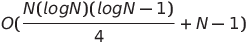
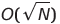
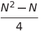
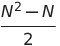

# Sorting Algorithms


[](https://app.codacy.com/gh/h-ssiqueira/Sort_Algorithms/dashboard?utm_source=gh&utm_medium=referral&utm_content=&utm_campaign=Badge_grade&style=for-the-badge)


## Summary
* [Description](#Description)
	* [How to execute](#How-to-execute)
	 	* [Linux & MAC](#Linux-&-MAC)
		* [Windows](#Windows)
* [Algorithms](#Algorithms)
* [Complexity Table](#Complexity-Table)
* [Tests](#Tests)
* [References](#References)


## Description
A program to show the execution time and the variaty of sorting algorithms in ```C``` language. There are 47 sorting algorithms avaliable distributed in 8 different categories.

### How to execute
On program settings there are avaliable modifications noted in table below:

Configuration | Default
:---: | :---:
Sorting case | Random
Random interval | 1024
Length of array | 10
Save results in a text file | NO
Display arrays | YES
Display execution time | YES

Note: you need to have the [GCC compiler](https://gcc.gnu.org/) installed in your machine to execute the instructions below to run the program.

#### Linux & MAC
Open a terminal and go to project's directory. Execute ```make``` in terminal allow to compile the program. Commands avaliable to execute with make (```make ${command}```):

Command | Description
:---: | :---:
clean | Clear all objects generated
cr | Compile and run
rmproper | Clear all object files
run | Execute main program

#### Windows
On Command Prompt or PowerShell and go to project's directory and execute ```execute.bat```.

<br>

## Algorithms

Category | Sort
:---: | :---:
[Esoteric & Fun & Miscellaneous](src/Esoteric_Fun_Miscellaneous) | [Bad Sort](src/Esoteric_Fun_Miscellaneous/Bad_Sort.c)<br>[Bogo Bogo Sort](src/Esoteric_Fun_Miscellaneous/Bogo_Bogo_Sort.c)<br>[Bogo Sort](src/Esoteric_Fun_Miscellaneous/Bogo_Sort.c)<br>[Bubble Bogo Sort](src/Esoteric_Fun_Miscellaneous/Bubble_Bogo_Sort.c)<br>[Cocktail Bogo Sort](src/Esoteric_Fun_Miscellaneous/Cocktail_Bogo_Sort.c)<br>[Exchange Bogo Sort](src/Esoteric_Fun_Miscellaneous/Exchange_Bogo_Sort.c)<br>[Less Bogo Sort](src/Esoteric_Fun_Miscellaneous/Less_Bogo_Sort.c)<br>[Pancake Sort](src/Esoteric_Fun_Miscellaneous/Pancake_Sort.c)<br>[Silly Sort](src/Esoteric_Fun_Miscellaneous/Silly_Sort.c)<br>[Slow Sort](src/Esoteric_Fun_Miscellaneous/Slow_Sort.c)<br>[Spaghetti Sort](src/Esoteric_Fun_Miscellaneous/Spaghetti_Sort.c)<br>[Stooge Sort](src/Esoteric_Fun_Miscellaneous/Stooge_Sort.c)
[Exchange](src/Exchange) | [Bubble Sort](src/Exchange/Bubble_Sort.c)<br>[Circle Sort](src/Exchange/Circle_Sort.c)<br>[Cocktail Shaker Sort](src/Exchange/Cocktail_Shaker_Sort.c)<br>[Comb Sort](src/Exchange/Comb_Sort.c)<br>[Dual Pivot Quick Sort](src/Exchange/Dual_Pivot_Quick_Sort.c)<br>[Gnome Sort](src/Exchange/Gnome_Sort.c)<br>[Odd-Even Sort](src/Exchange/Odd-Even_Sort.c)<br>[Optimized Bubble Sort](src/Exchange/Optimized_Bubble_Sort.c)<br>[Optimized Cocktail Shaker Sort](src/Exchange/Optimized_Cocktail_Shaker_Sort.c)<br>[Optimized Gnome Sort](src/Exchange/Optimized_Gnome_Sort.c)<br>[Quick Sort](src/Exchange/Quick_Sort.c)<br>[Quick Sort 3-way](src/Exchange/Quick_Sort_3-way.c)<br>[Stable Quick Sort](src/Exchange/Stable_Quick_Sort.c)
[Hybrids](src/Hybrids) | [Tim Sort](src/Hybrids/Tim_Sort.c)
[Insertion](src/Insertion) | [AVL Tree Sort](src/Insertion/AVLTree_Sort.c)<br>[Binary Insertion Sort](src/Insertion/Binary_Insertion_Sort.c)<br>[Cycle Sort](src/Insertion/Cycle_Sort.c)<br>[Insertion Sort](src/Insertion/Insertion_Sort.c)<br>[Patience Sort](src/Insertion/Patience_Sort.c)<br>[Shell Sort](src/Insertion/Shell_Sort.c)<br>[Tree Sort](src/Insertion/Tree_Sort.c)
[Merge](src/Merge) | [Bottom-up Merge Sort](src/Merge/Bottom-Up_Merge_Sort.c)<br>[In-Place Merge Sort](src/Merge/In-Place_Merge_Sort.c)<br>[Merge Sort](Merge/src/Merge_Sort.c)
[Networks & Concurrent](src/Networks_Concurrent) | [Bitonic Sort](src/Networks_Concurrent/Bitonic_Sort.c)<br>[Pairwise Network Sort](src/Networks_Concurrent/Pairwise_Network_Sort.c)
[Non-Comparison & Distribution](src/Non-Comparison_Distribution) | [Bucket Sort](src/Non-Comparison_Distribution/Bucket_Sort.c)<br>[Counting Sort](src/Non-Comparison_Distribution/Counting_Sort.c)<br>[Gravity (Bead) Sort](src/Non-Comparison_Distribution/Gravity_(Bead)_Sort.c)<br>[Pigeonhole Sort](src/Non-Comparison_Distribution/Pigeonhole_Sort.c)<br>[Radix LSD Sort](src/Non-Comparison_Distribution/Radix_LSD.c)
[Selection](src/Selection) | [Double Selection Sort](src/Selection/Double_Selection_Sort.c)<br>[Max Heap Sort](src/Selection/Max_Heap_Sort.c)<br>[Min Heap Sort](src/Selection/Min_Heap_Sort.c)<br>[Selection Sort](src/Selection/Selection_Sort.c)

<br>

## Complexity Table

Algorithm | Worst case | Best case | Average | Space complexity | In-place | Stable | Notes
:---: | :---: | :---: | :---: | :---: | :---: | :---: | :---:
[Bad Sort](src/Esoteric_Fun_Miscellaneous/Bad_Sort.c) | O(N³) | O(N³) | O(N³) | O(1) | **:heavy_check_mark:** | **:x:** |
[Bogo Bogo Sort](src/Esoteric_Fun_Miscellaneous/Bogo_Bogo_Sort.c) | O(infinity) | O(N²) | O((N+1)!) | O(1) | **:heavy_check_mark:** | **:x:** | The worst case can be unbounded due to random manipulation
[Bogo Sort](src/Esoteric_Fun_Miscellaneous/Bogo_Sort.c) | O(infinity) | O(N) | O((N+1)!) | O(1) | **:heavy_check_mark:** | **:x:** | The worst case can be unbounded due to random manipulation
[Bubble Bogo Sort](src/Esoteric_Fun_Miscellaneous/Bubble_Bogo_Sort.c) | O(infinity) | O(N) | O((N+1)!) | O(1) | **:heavy_check_mark:** | **:heavy_check_mark:** | The worst case can be unbounded due to random manipulation
[Cocktail Bogo Sort](src/Esoteric_Fun_Miscellaneous/Cocktail_Bogo_Sort.c) | O(infinity) | O(N) | O((N+1)!) | O(1) | **:heavy_check_mark:** | **:x:** | The worst case can be unbounded due to random manipulation
[Exchange Bogo Sort](src/Esoteric_Fun_Miscellaneous/Exchange_Bogo_Sort.c) | O(infinity) | O(N) | O((N+1)!) | O(1) | **:heavy_check_mark:** | **:x:** | The worst case can be unbounded due to random manipulation
[Less Bogo Sort](src/Esoteric_Fun_Miscellaneous/Less_Bogo_Sort.c) | O(infinity) | O(N²) | O((N+1)!) | O(1) | **:heavy_check_mark:** | **:x:** | The worst case can be unbounded due to random manipulation
[Pancake Sort](src/Esoteric_Fun_Miscellaneous/Pancake_Sort.c) | O(N²) | O(N²) | O(N²) | O(1) | **:heavy_check_mark:** | **:x:** |
[Silly Sort](src/Esoteric_Fun_Miscellaneous/Silly_Sort.c) | O(N²) | O(N²) | O(N²) | O(1) | **:heavy_check_mark:** | **:x:** |
[Slow Sort](src/Esoteric_Fun_Miscellaneous/Slow_Sort.c) | O(N\*N!) | O(N) | O((N+1)!) | O(1) | **:heavy_check_mark:** | **:x:** |
[Spaghetti Sort](src/Esoteric_Fun_Miscellaneous/Spaghetti_Sort.c) | O(N) | O(N) | O(N) | O(N) | **:x:** | **:heavy_check_mark:** |
[Stooge Sort](src/Esoteric_Fun_Miscellaneous/Stooge_Sort.c) |  |  |  | O(N) | **:x:** | **:x:** |
[Bubble Sort](src/Exchange/Bubble_Sort.c) | O(N²) | O(N) | O(N²) | O(1) | **:heavy_check_mark:** | **:heavy_check_mark:** |
[Circle Sort](src/Exchange/Circle_Sort.c) | O(N log N log N) | O(N log N) | O(N log N) | O(1) | **:heavy_check_mark:** | **:x:** |
[Cocktail Shaker Sort](src/Exchange/Cocktail_Shaker_Sort.c) | O(N²) | O(N²) | O(N²) | O(1) | **:heavy_check_mark:** | **:heavy_check_mark:** |
[Comb Sort](src/Exchange/Comb_Sort.c) | O(N²) | O(N log N) |  | O(1) | **:heavy_check_mark:** | **:x:** | **P** is the number of increments
[Dual Pivot Quick Sort](src/Exchange/Dual_Pivot_Quick_Sort.c) | O(N²) | O(N log N) | O(N log N) | O(log N) | **:heavy_check_mark:** | **:x:** |
[Gnome Sort](src/Exchange/Gnome_Sort.c) | O(N²) | O(N) | O(N²) | O(1) | **:heavy_check_mark:** | **:heavy_check_mark:** |
[Odd-Even Sort](src/Exchange/Odd-Even_Sort.c) | O(N²) | O(N) | O(N²) | O(1) | **:heavy_check_mark:** | **:heavy_check_mark:** |
[Optimized Bubble Sort](src/Exchange/Optimized_Bubble_Sort.c) | O(N²) | O(N) | O(N²) | O(1) | **:heavy_check_mark:** | **:heavy_check_mark:** |
[Optimized Cocktail Shaker Sort](src/Exchange/Cocktail_Shaker_Sort.c) | O(N²) | O(N) | O(N²) | O(1) | **:heavy_check_mark:** | **:heavy_check_mark:** |
[Optimized Gnome Sort](src/Exchange/Optimized_Gnome_Sort.c) | O(N²) | O(N) | O(N²) | O(1) | **:heavy_check_mark:** | **:heavy_check_mark:** |
[Quick Sort](src/Exchange/Quick_Sort.c) | O(N²) | O(N log N) | O(N log N) | O(log N) | **:heavy_check_mark:** | **:x:** |
[Quick Sort 3-way](src/Exchange/Quick_Sort_3-way.c) | O(N²) | O(N) | O(N log N) | O(log N) or O(N) | **:heavy_check_mark:** | **:x:** |
[Stable Quick Sort](src/Exchange/Stable_Quick_Sort.c) | O(N²) | O(N log N) | O(N log N) | O(N) | **:heavy_check_mark:** | **:heavy_check_mark:** |
[Tim Sort](src/Hybrids/Tim_Sort.c) | O(N log N) | O(N) | O(N log N) | O(N) | **:x:** | **:heavy_check_mark:** |
[AVL Tree Sort](src/Insertion/AVLTree_Sort.c) | O(N log N) | O(N) | O(N log N) | O(N) | **:x:** | **:heavy_check_mark:** | In worst case, O(N²) when using Binary Search Tree and O(N log N) when using Self-Balanced Binary Search Tree
[Binary Insertion Sort](src/Insertion/Binary_Insertion_Sort.c) | O(N log N) | O(N) | O(N log N) | O(1) | **:heavy_check_mark:** | **:heavy_check_mark:** |
[Cycle Sort](src/Insertion/Cycle_Sort.c) | O(N²) | O(N²) | O(N²) | O(1) | **:heavy_check_mark:** | **:x:** |
[Insertion Sort](src/Insertion/Insertion_Sort.c) | O(N²) | O(N) | O(N²) | O(1) | **:heavy_check_mark:** | **:heavy_check_mark:** |
[Patience Sort](src/Insertion/Patience_Sort.c) | O(N log N) | O(N) | O(N log N) | O(N) | **:x:** | **:heavy_check_mark:** |
[Shell Sort](src/Insertion/Shell_Sort.c) |  or O(N log² N) | O(N log N) | O(N^1.25) to O(N²) | O(1) | **:heavy_check_mark:** | **:x:** |
[Tree Sort](src/Insertion/Tree_Sort.c) | O(N²) | O(N log N) | O(N log N) | O(N) | **:x:** | **:heavy_check_mark:** | In worst case, O(N²) when using Binary Search Tree and O(N log N) when using Self-Balanced Binary Search Tree
[Bottom-up Merge Sort](src/Merge/Bottom-Up_Merge_Sort.c) | O(N log N) | O(N log N) | O(N log N) | O(N) | **:x:** | **:heavy_check_mark:** |
[In-Place Merge Sort](src/Merge/In-Place_Merge_Sort.c) | O(N²) | O(N²) | O(N²) | O(log N) | **:heavy_check_mark:** | **:heavy_check_mark:** |
[Merge Sort](Merge/src/Merge_Sort.c) | O(N log N) | O(N log N) | O(N log N) | O(N) | **:x:** | **:heavy_check_mark:** |
[Bitonic Sort](src/Networks_Concurrent/Bitonic_Sort.c) | O(log² N) | O(log² N) | O(log² N) | O(N log² N) | **:heavy_check_mark:** | **:x:** |
[Pairwise Network Sort](src/Networks_Concurrent/Pairwise_Network_Sort.c) |  or O(N log N) | O(N log N) | O(N log N) |  | **:heavy_check_mark:** | **:x:** | Worst case is using parallel time and space complexity non-parallel time
[Bucket Sort](src/Non-Comparison_Distribution/Bucket_Sort.c) | O(N²) | O(N+k) | O(N+k) | O(N+k) | **:x:** | **:heavy_check_mark:** | **k** is the number of buckets
[Counting Sort](src/Non-Comparison_Distribution/Counting_Sort.c) | O(N+k) | O(N+k) | O(N+k) | O(N+k) | **:x:** | **:heavy_check_mark:** | **k** is the range of input data
[Gravity (Bead) Sort](src/Non-Comparison_Distribution/Gravity_(Bead)_Sort.c) | O(S) | O(1) or  | O(N) | O(N²) | **:x:** | **:heavy_check_mark:** | **S** is the sum of array elements, O(1) cannot be implemented in practice
[Pigeonhole Sort](src/Non-Comparison_Distribution/Pigeonhole_Sort.c) | O(N+n) | O(N+n) | O(N+n) | O(N+n) | **:x:** | **:heavy_check_mark:** | **N** is the number of elements and **n** is the range of input data
[Radix LSD Sort](src/Non-Comparison_Distribution/Radix_LSD.c) | O(NW) | O(NW) | O(NW) | O(N) | **:x:** | **:heavy_check_mark:** | **W** is the maxumum element width (bits)
[Double Selection Sort](src/Selection/Double_Selection_Sort.c) | O(N²) | O(N²) | O(N²) | O(1) | **:heavy_check_mark:** | **:x:** |  Comparisons
[Max Heap Sort](src/Selection/Max_Heap_Sort.c) | O(N log N) | O(N log N) | O(N log N) | O(1) | **:heavy_check_mark:** | **:x:** |
[Min Heap Sort](src/Selection/Min_Heap_Sort.c) | O(N log N) | O(N log N) | O(N log N) | O(1) | **:heavy_check_mark:** | **:x:** |
[Selection Sort](src/Selection/Selection_Sort.c) | O(N²) | O(N²) | O(N²) | O(1) | **:heavy_check_mark:** | **:x:** |  Comparisons

## [Tests](tests/README.md)

<hr>

Licensed by [MIT License](LICENSE)
